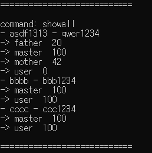

# simple_ATM  
This is a simple_ATM program in which the following four functions are sequentially implemented.  
Insert Card => PIN number => Select Account => See Balance/Deposit/Withdraw  
  
Support four command:  
1. showall: show card list, pin number, account list, balances.  
2. showcard: show card list.  
3. showaccount: show account list of selected card.  
4. quit  
  
You can test program with the data below.  
</img> 
